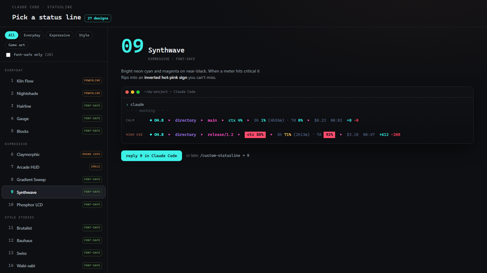
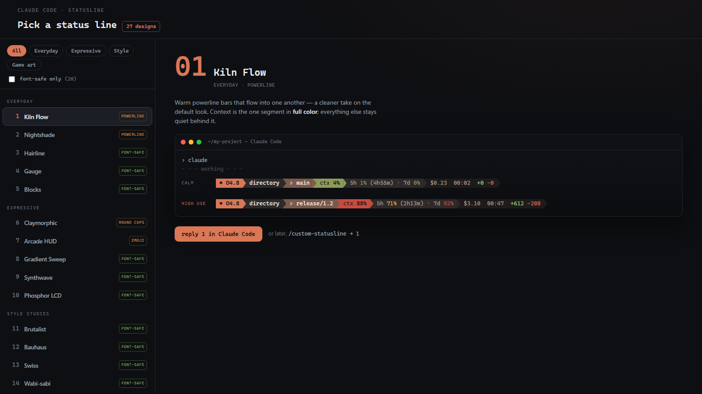
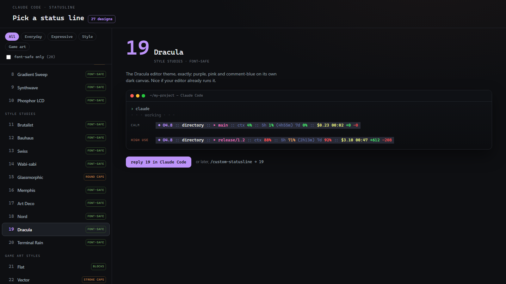
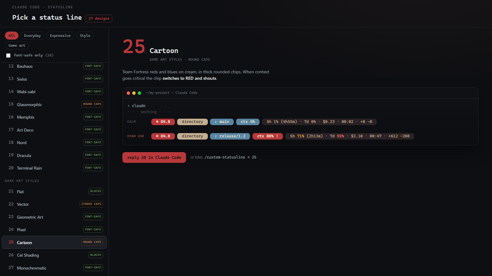
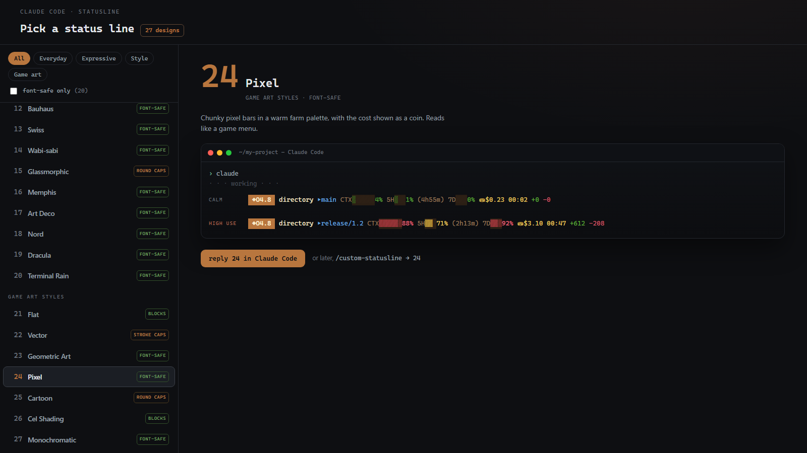

<h1 align="center">custom-statusline</h1>

<p align="center"><b>27 ready-made status line designs for Claude Code.</b><br>
Browse a gallery, reply with a number, and your terminal status line is live at the next prompt.</p>

<p align="center">
  <a href="https://umarfarooque88.github.io/custom-statusline/"><b>▶ Browse all 27 online</b></a>
  &nbsp;·&nbsp; no install needed
</p>

<p align="center"></p>

---

Your Claude Code status line shows the things you actually want at a glance — model, directory, git branch, context usage, your 5-hour and 7-day rate limits, cost, active time, and lines changed. This skill gives you **27 different ways to show them**, from quiet daily-drivers to full game-art HUDs. Every design renders the same data; you just pick the look.

Pick by number from a visual gallery, and the skill installs it for you. Change your mind anytime by running the same command again.

## Install

Two steps.

**1 — Tell Claude Code to clone it:**

```
clone https://github.com/umarfarooque88/custom-statusline
```

Claude places the skill in `~/.claude/skills/` and tells you what's next.

**2 — Run the skill:**

```
/custom-statusline
```

The gallery opens in your browser. Find one you like, reply with its **number** in Claude Code, and you're done — the status line goes live at your next prompt, no restart needed.

> If the command isn't recognized right after installing, run `/reload-skills` or restart Claude Code once.

**To change designs later,** run `/custom-statusline` again. Same gallery, same flow — that's the only command to remember.

## A few of the looks

Every preview in the gallery is rendered from the **real engine output**, so what you see is exactly what your terminal will show. A sample of the range:

<p align="center">
  
  
</p>
<p align="center">
  
  
</p>

## What each design shows

Every design renders the full data set. Segments hide automatically when their data isn't available.

| Segment | Example | Notes |
|---|---|---|
| Model | `◆ O4.8` | Short name (Opus 4.8 → O4.8) |
| Directory | `my-project` | Current folder |
| Git branch | `▸ main` | Only inside a git repo |
| Context used | `ctx 37%` | Green → amber → red as it fills |
| 5-hour limit | `5h 42% (2h13m)` | Usage %, plus a countdown to when the window resets · Pro/Max |
| 7-day limit | `7d 18%` | Weekly usage · Pro/Max |
| Session cost | `$0.84` | Claude Code's own API-equivalent estimate |
| Active time | `00:09` | Hours:minutes |
| Lines changed | `+58 -9` | Added / removed this session |

The `(2h13m)` reset countdown appears once the 5-hour window has a reset time (Pro/Max, after the first response) and hides until then. Nerd-font designs draw the branch with a powerline glyph rather than `▸`.

## The 27 designs

| Everyday | Expressive | Style studies | Game art styles |
|---|---|---|---|
| 1 · Kiln Flow | 6 · Claymorphic | 11 · Brutalist | 21 · Flat |
| 2 · Nightshade | 7 · Arcade HUD | 12 · Bauhaus | 22 · Vector |
| 3 · Hairline | 8 · Gradient Sweep | 13 · Swiss | 23 · Geometric Art |
| 4 · Gauge | 9 · Synthwave | 14 · Wabi-sabi | 24 · Pixel |
| 5 · Blocks | 10 · Phosphor LCD | 15 · Glassmorphic | 25 · Cartoon |
| | | 16 · Memphis | 26 · Cel Shading |
| | | 17 · Art Deco | 27 · Monochromatic |
| | | 18 · Nord | |
| | | 19 · Dracula | |
| | | 20 · Terminal Rain | |

Most designs are **font-safe** and work in any terminal. A handful (1, 2, 6, 15, 25, and Vector's stroke caps) use powerline / nerd-font glyphs — Windows Terminal's default Cascadia Mono has them. Seeing boxes? Pick a font-safe design, or set `STATUSLINE_PLAIN=1` for plain-glyph fallbacks with the colors intact.

## How it works

One script, `statusline.sh`, contains all 27 designs. Installing one copies that script to `~/.claude/statusline-command.sh`, sets a single design number, and enables the `statusLine` key in your `settings.json` — merging into your existing settings, never overwriting them. The engine parses the status line JSON with Node (no `jq` needed) and detects your git branch without spawning a shell, so it works the same on Windows, macOS, and Linux.

The gallery previews aren't hand-drawn — they're **generated from the engine's real ANSI output** by `tools/build-gallery.js`, so the catalog can never drift from what your terminal actually renders.

## Requirements

- **Node.js** on your PATH — the engine uses it to parse JSON.
- **git** for the branch segment (optional; it hides gracefully without a repo).
- A **powerline / Nerd font** for designs 1, 2, 6, 15, 25 and Vector's stroke caps. Windows Terminal's default works. Everything else is font-safe.

## Manual install (without Claude)

```bash
mkdir -p ~/.claude/skills
git clone https://github.com/umarfarooque88/custom-statusline ~/.claude/skills/custom-statusline
cp ~/.claude/skills/custom-statusline/statusline.sh ~/.claude/statusline-command.sh
# edit the DESIGN= line near the top of the copied file and pick 1–27
```

Then merge this into `~/.claude/settings.json` (create the file as `{}` if it doesn't exist):

```json
"statusLine": { "type": "command", "command": "bash ~/.claude/statusline-command.sh" }
```

## What's in the repo

| Path | Purpose |
|------|---------|
| `SKILL.md` | The skill Claude follows when you run `/custom-statusline` |
| `statusline.sh` | The engine — all 27 designs in one script |
| `gallery.html` | The visual picker (opens locally or [online](https://umarfarooque88.github.io/custom-statusline/)); previews generated from real engine output |
| `tools/` | `build-gallery.js` regenerates previews from the engine; `ansi2html.js` converts terminal output to preview HTML |
| `CLAUDE.md` | Setup instructions Claude follows when you say "clone this repo" |

---

<p align="center"><sub>Made by <a href="https://github.com/umarfarooque88">Umar Farooque</a> · a <a href="https://www.claude.com/product/claude-code">Claude Code</a> skill</sub></p>

